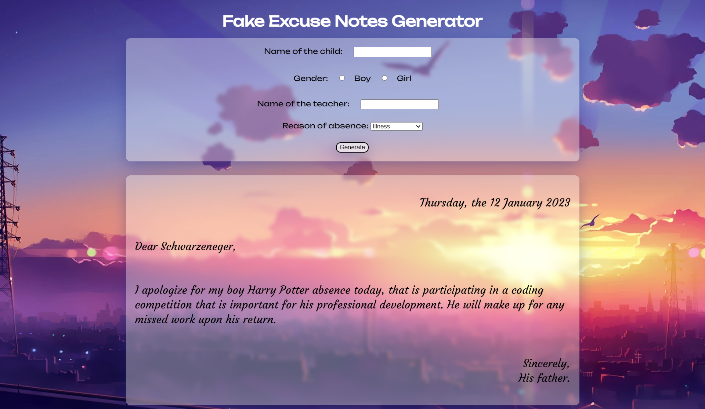

<br/>
<p align="center">
  <a href="https://github.com/manesjonathan/php">
    
  </a>

  <h3 align="center">PHP</h3>

  <p align="center">
    PHP fundamentals exercices
    <br/>
    <br/>
  </p>
</p>

    

## About The Project



This repository contains exercises of php fundamentals done as part of my training at becode.

## Built With

PHP 8.2.

## Getting Started

This is an example of how you may give instructions on setting up your project locally.
To get a local copy up and running follow these simple example steps.

### Prerequisites

- PHP 8.2
- WAMP (or other)
- VSC
- Live server
- PHP Server

### Installation

```sh
git clone https://github.com/manesjonathan/php.git
```

## Usage

To run the Fake Generator Excuse, open [excuse.php](variable/excuse.php) in live server.


## Authors

* **[Jonathan Manes](https://github.com/manesjonathan/)** - *Web Developer @BeCode.org* - 

## Acknowledgements

* [BeCode.org](https://github.com/becodeorg)
